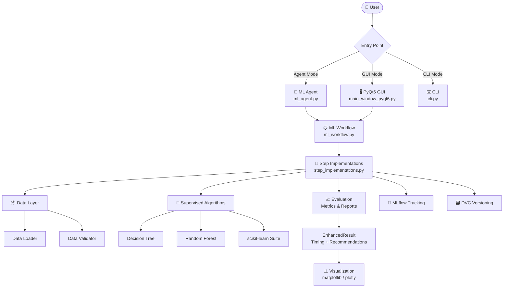
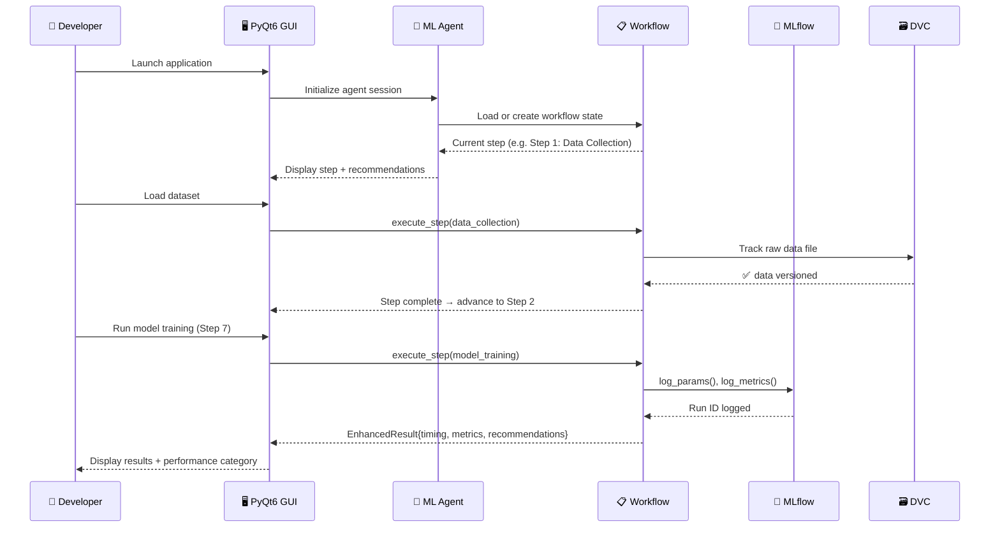
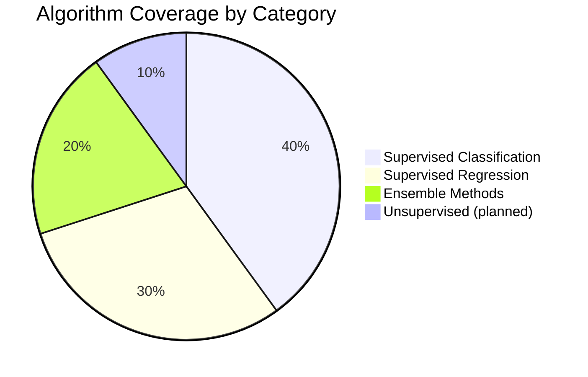
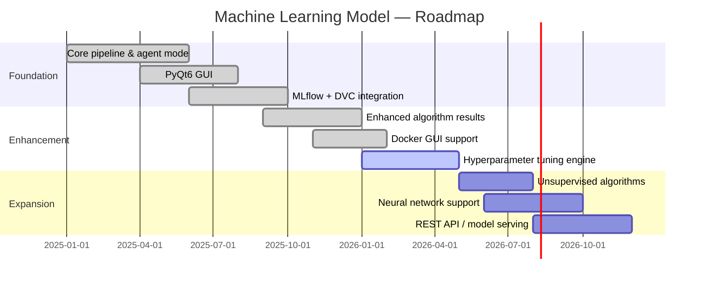

<div align="center">
  <h1>🤖 Machine Learning Model</h1>
  <p><em>Agent-guided ML pipeline framework with PyQt6 GUI, experiment tracking, and production-ready model automation.</em></p>
</div>

<div align="center">

[](LICENSE)
[](https://github.com/hkevin01/Machine-Learning-Model/stargazers)
[](https://github.com/hkevin01/Machine-Learning-Model/network)
[](https://github.com/hkevin01/Machine-Learning-Model/commits/main)
[](https://github.com/hkevin01/Machine-Learning-Model)
[](https://github.com/hkevin01/Machine-Learning-Model/issues)
[](https://python.org)
[](https://www.riverbankcomputing.com/software/pyqt/)
[](https://scikit-learn.org)
[](https://mlflow.org)
[](https://dvc.org)
[](https://www.docker.com)

</div>

---

## Table of Contents

- [Overview](#overview)
- [Key Features](#key-features)
- [Architecture](#architecture)
- [Usage Flow](#usage-flow)
- [Algorithm Coverage](#algorithm-coverage)
- [Technology Stack](#technology-stack)
- [Setup & Installation](#setup--installation)
- [Usage](#usage)
- [Core Capabilities](#core-capabilities)
- [Experiment Tracking](#experiment-tracking)
- [Data Versioning](#data-versioning)
- [Roadmap](#roadmap)
- [Development Status](#development-status)
- [Contributing](#contributing)
- [License](#license)

---

## Overview

**Machine Learning Model** is a comprehensive, agent-driven ML framework that automates the full machine learning lifecycle — from raw data ingestion to production model deployment — through a 13-step guided pipeline. It targets data scientists, ML engineers, and developers who want structured, reproducible ML workflows without sacrificing flexibility.

The framework pairs a PyQt6 graphical interface with an intelligent ML agent that provides context-aware recommendations at every pipeline stage. Traditional algorithm exploration and AI-guided automation coexist in a single, unified environment.

> [!IMPORTANT]
> Agent Mode is the primary workflow entry point. It guides you step-by-step through the entire ML pipeline with automatic state persistence so you can pause and resume at any stage.

<p align="right">(<a href="#top">back to top ↑</a>)</p>

---

## Key Features

| <sub>Icon</sub> | <sub>Feature</sub> | <sub>Description</sub> | <sub>Impact</sub> | <sub>Status</sub> |
|------|---------|-------------|--------|--------|
| <sub>🤖</sub> | <sub>**ML Agent**</sub> | <sub>AI-powered assistant navigating the 13-step pipeline</sub> | <sub>Critical</sub> | <sub>✅ Stable</sub> |
| <sub>🖥️</sub> | <sub>**PyQt6 GUI**</sub> | <sub>Interactive workflow navigator with real-time progress</sub> | <sub>High</sub> | <sub>✅ Stable</sub> |
| <sub>💾</sub> | <sub>**State Persistence**</sub> | <sub>Auto save/load of workflow progress across sessions</sub> | <sub>High</sub> | <sub>✅ Stable</sub> |
| <sub>📊</sub> | <sub>**Enhanced Results**</sub> | <sub>Execution timing, hyperparameters, smart recommendations</sub> | <sub>High</sub> | <sub>✅ Stable</sub> |
| <sub>🧪</sub> | <sub>**MLflow Tracking**</sub> | <sub>Experiment logging: params, metrics, feature importances</sub> | <sub>Medium</sub> | <sub>✅ Stable</sub> |
| <sub>🗃️</sub> | <sub>**DVC Versioning**</sub> | <sub>Reproducible data & model pipelines via DVC</sub> | <sub>Medium</sub> | <sub>✅ Stable</sub> |
| <sub>🐳</sub> | <sub>**Docker Support**</sub> | <sub>GUI-in-container with X11 forwarding and font rendering</sub> | <sub>Medium</sub> | <sub>✅ Stable</sub> |
| <sub>⚙️</sub> | <sub>**Hyperparameter Tuning**</sub> | <sub>Automated optimization integrated into pipeline</sub> | <sub>High</sub> | <sub>🟡 Beta</sub> |
| <sub>📡</sub> | <sub>**Drift Monitoring**</sub> | <sub>Continuous learning and model drift detection</sub> | <sub>Medium</sub> | <sub>🟡 Beta</sub> |

**Highlights:**

- **13-step automated pipeline**: Data Collection → Preprocessing → EDA → Feature Engineering → Splitting → Algorithm Selection → Training → Evaluation → Tuning → Deployment → Monitoring → Experiment Tracking → Data Versioning
- **Rich algorithm output**: every algorithm run returns execution time, full hyperparameter config, performance category (Excellent/Good/Fair/Poor), and actionable recommendations
- **Cross-platform**: Linux, Windows, and basic macOS support with both shell and batch launchers

<p align="right">(<a href="#top">back to top ↑</a>)</p>

---

## Architecture

### System Architecture



### Component Responsibilities

| <sub>Component</sub> | <sub>Location</sub> | <sub>Responsibility</sub> |
|-----------|----------|----------------|
| <sub>`ML Agent`</sub> | <sub>`workflow/ml_agent.py`</sub> | <sub>Orchestrates pipeline steps, provides context-aware recommendations</sub> |
| <sub>`ML Workflow`</sub> | <sub>`workflow/ml_workflow.py`</sub> | <sub>State machine managing 13-step progression and persistence</sub> |
| <sub>`Step Implementations`</sub> | <sub>`workflow/step_implementations.py`</sub> | <sub>Concrete logic for each pipeline stage</sub> |
| <sub>`PyQt6 GUI`</sub> | <sub>`gui/main_window_pyqt6.py`</sub> | <sub>Interactive dashboard, progress tracking, real-time output</sub> |
| <sub>`CLI`</sub> | <sub>`cli.py`</sub> | <sub>Typer-based command-line interface</sub> |
| <sub>`Supervised`</sub> | <sub>`supervised/`</sub> | <sub>Decision Tree, Random Forest with enhanced result output</sub> |
| <sub>`Tracking`</sub> | <sub>`tracking/`</sub> | <sub>MLflow integration for experiment logging</sub> |
| <sub>`Visualization`</sub> | <sub>`visualization/`</sub> | <sub>matplotlib, seaborn, plotly chart generation</sub> |

> [!NOTE]
> All pipeline state is automatically serialized to disk so sessions survive crashes or intentional exits. Resume by re-launching — the agent picks up where you left off.

<p align="right">(<a href="#top">back to top ↑</a>)</p>

---

## Usage Flow

### End-to-End Interaction Sequence



<p align="right">(<a href="#top">back to top ↑</a>)</p>

---

## Algorithm Coverage

### Supported Algorithm Distribution



| <sub>Category</sub> | <sub>Algorithms</sub> | <sub>Status</sub> |
|----------|-----------|--------|
| <sub>Supervised Classification</sub> | <sub>Decision Tree, Random Forest, SVM, KNN, Logistic Regression</sub> | <sub>✅ Stable</sub> |
| <sub>Supervised Regression</sub> | <sub>Linear Regression, Decision Tree Regressor, Random Forest Regressor</sub> | <sub>✅ Stable</sub> |
| <sub>Ensemble Methods</sub> | <sub>Random Forest, XGBoost, LightGBM</sub> | <sub>✅ Stable</sub> |
| <sub>Unsupervised Clustering</sub> | <sub>K-Means, DBSCAN</sub> | <sub>🟡 Planned</sub> |
| <sub>Neural Networks</sub> | <sub>scikit-learn MLPClassifier</sub> | <sub>🟡 Planned</sub> |

<p align="right">(<a href="#top">back to top ↑</a>)</p>

---

## Technology Stack

| <sub>Technology</sub> | <sub>Purpose</sub> | <sub>Why Chosen</sub> | <sub>Alternatives Considered</sub> |
|------------|---------|------------|------------------------|
| <sub>**Python 3.8+**</sub> | <sub>Core runtime</sub> | <sub>Ubiquitous ML ecosystem, broad OS support</sub> | <sub>Julia, R</sub> |
| <sub>**scikit-learn**</sub> | <sub>ML algorithms</sub> | <sub>Battle-tested, consistent API, rich estimator library</sub> | <sub>PyTorch, TensorFlow</sub> |
| <sub>**XGBoost / LightGBM**</sub> | <sub>Gradient boosting</sub> | <sub>State-of-the-art tabular performance</sub> | <sub>CatBoost</sub> |
| <sub>**PyQt6**</sub> | <sub>Desktop GUI</sub> | <sub>Native look/feel, rich widget set, Linux/Win/Mac</sub> | <sub>Tkinter, Dear PyGui</sub> |
| <sub>**MLflow**</sub> | <sub>Experiment tracking</sub> | <sub>Self-hostable, rich UI, scikit-learn autolog</sub> | <sub>Weights & Biases, Neptune</sub> |
| <sub>**DVC**</sub> | <sub>Data versioning</sub> | <sub>Git-native, storage-agnostic, pipeline support</sub> | <sub>LakeFS, Pachyderm</sub> |
| <sub>**Docker**</sub> | <sub>Containerization</sub> | <sub>Reproducible GUI environment, CI isolation</sub> | <sub>Podman</sub> |
| <sub>**pytest**</sub> | <sub>Testing</sub> | <sub>Fixture system, coverage plugins, hypothesis</sub> | <sub>unittest</sub> |
| <sub>**loguru**</sub> | <sub>Logging</sub> | <sub>Structured logs, rotation, zero-boilerplate</sub> | <sub>standard logging</sub> |
| <sub>**Typer + Rich**</sub> | <sub>CLI</sub> | <sub>Auto-help generation, colored output</sub> | <sub>Click, argparse</sub> |

<p align="right">(<a href="#top">back to top ↑</a>)</p>

---

## Setup & Installation

### Prerequisites

- Python **3.8 – 3.12**
- Git
- Docker *(optional, for containerized GUI)*
- A display server *(X11 or Wayland for GUI)*

### Clone & Install

```bash
git clone https://github.com/hkevin01/Machine-Learning-Model.git
cd Machine-Learning-Model
```

**Linux / macOS:**

```bash
python3 -m venv venv
source venv/bin/activate
pip install -r requirements.txt
# Dev + ML + viz extras
pip install -r requirements-dev.txt
```

**Windows:**

```batch
python -m venv venv
venv\Scripts\activate
pip install -r requirements.txt
```

### Environment Variables

Copy the example environment file and configure as needed:

```bash
cp .env.example .env
```

```env
# .env
MLFLOW_TRACKING_URI=http://localhost:5000
MLFLOW_EXPERIMENT_NAME=default
```

### Verify Setup

```bash
python scripts/validate_setup.py
```

> [!TIP]
> Run `make mlflow-ui` after installing dev dependencies to open the MLflow experiment dashboard at [http://localhost:5000](http://localhost:5000).

<p align="right">(<a href="#top">back to top ↑</a>)</p>

---

## Usage

### Option 1 — Agent Mode (Recommended)

```bash
# Linux / macOS
./run_agent.sh

# Windows
run_agent.bat
```

The agent launches an interactive CLI + GUI session and guides you through all 13 pipeline steps.

### Option 2 — PyQt6 GUI

```bash
# Unified launcher (Docker or local)
./run.sh               # Launch GUI in Docker
./run.sh --local       # Launch GUI natively
./run.sh --headless    # Headless import smoke-test
./run.sh --rebuild     # Force rebuild Docker image
./run.sh --healthcheck # Environment & ML diagnostics
```

### Option 3 — CLI

```bash
python -m machine_learning_model --help
```

### Option 4 — Python API

```python
from machine_learning_model.workflow.ml_agent import MLAgent

agent = MLAgent()
agent.run()  # Starts the guided 13-step pipeline
```

**Enhanced Algorithm Output:**

```python
from machine_learning_model.supervised.random_forest import run_algorithm

result = run_algorithm("Random Forest", "classification", spec)
print(f"Execution Time : {result.execution_time:.4f}s")
print(f"Performance    : {result.performance_summary}")   # "Accuracy: 0.934 (Excellent)"
print(f"Recommendations: {result.recommendations}")       # ["Try cross-validation", ...]
```

<p align="right">(<a href="#top">back to top ↑</a>)</p>

---

## Core Capabilities

### 🤖 Agent Mode Pipeline

The ML Agent executes a deterministic 13-step workflow. Each step is independently resumable:

| <sub>#</sub> | <sub>Step</sub> | <sub>Description</sub> |
|---|------|-------------|
| <sub>1</sub> | <sub>**Data Collection**</sub> | <sub>Automated dataset loading and schema validation</sub> |
| <sub>2</sub> | <sub>**Data Preprocessing**</sub> | <sub>Cleaning, null handling, encoding, type coercion</sub> |
| <sub>3</sub> | <sub>**Exploratory Data Analysis**</sub> | <sub>Automated statistical summary and distribution plots</sub> |
| <sub>4</sub> | <sub>**Feature Engineering**</sub> | <sub>Scaling, polynomial features, selection</sub> |
| <sub>5</sub> | <sub>**Data Splitting**</sub> | <sub>Stratified train / validation / test splitting</sub> |
| <sub>6</sub> | <sub>**Algorithm Selection**</sub> | <sub>Automatic algorithm recommendation based on data profile</sub> |
| <sub>7</sub> | <sub>**Model Training**</sub> | <sub>Multi-algorithm training with MLflow logging</sub> |
| <sub>8</sub> | <sub>**Model Evaluation**</sub> | <sub>Accuracy, F1, ROC-AUC, R², MSE with visual reports</sub> |
| <sub>9</sub> | <sub>**Hyperparameter Tuning**</sub> | <sub>Grid/random search with cross-validation</sub> |
| <sub>10</sub> | <sub>**Model Deployment**</sub> | <sub>Pickle + ONNX export, production-ready persistence</sub> |
| <sub>11</sub> | <sub>**Monitoring**</sub> | <sub>Drift detection and continuous learning hooks</sub> |
| <sub>12</sub> | <sub>**Experiment Tracking**</sub> | <sub>MLflow run comparison and artifact logging</sub> |
| <sub>13</sub> | <sub>**Data Versioning**</sub> | <sub>DVC pipeline for fully reproducible data & model history</sub> |

### 📊 Enhanced Algorithm Results

Every algorithm execution returns an `EnhancedResult` object:

```python
@dataclass
class EnhancedResult:
    execution_time: float          # Precise wall-clock timing
    model_params: dict             # Full hyperparameter configuration
    performance_summary: str       # "Accuracy: 0.934 (Excellent)"
    recommendations: list[str]     # Context-aware next-step suggestions
    extended_metrics: dict         # AUC, F1-macro, confusion matrix, etc.
    model_insights: dict           # Algorithm-specific info (feature importances, etc.)
```

> [!WARNING]
> Performance categories (Excellent/Good/Fair/Poor) are heuristic thresholds. Always validate against your domain's acceptable error bounds before deployment.

### 🖥️ PyQt6 GUI Features

- Real-time pipeline step progress tracker
- Side-by-side algorithm comparison panel
- Integrated log viewer with severity filtering
- Decision boundary and feature importance charts
- Keyboard shortcuts for power users:
  - Press <kbd>Ctrl</kbd>+<kbd>R</kbd> to run the current pipeline step
  - Press <kbd>Ctrl</kbd>+<kbd>N</kbd> to advance to the next step
  - Press <kbd>Ctrl</kbd>+<kbd>S</kbd> to save workflow state

<p align="right">(<a href="#top">back to top ↑</a>)</p>

---

## Experiment Tracking

MLflow is integrated into Steps 7–9 of the pipeline. Enable it with:

```bash
pip install -r requirements-dev.txt
make mlflow-ui        # Opens http://localhost:5000
```

Configure in `.env`:

```env
MLFLOW_TRACKING_URI=http://localhost:5000
MLFLOW_EXPERIMENT_NAME=default
```

When enabled, all built-in algorithms automatically log:
- Hyperparameters (`log_params`)
- Evaluation metrics (`log_metrics`)
- Feature importances (`log_artifact`)
- Trained model artifacts (`mlflow.sklearn.log_model`)

<p align="right">(<a href="#top">back to top ↑</a>)</p>

---

## Data Versioning

A minimal DVC pipeline is defined in `dvc.yaml` with two stages: **prepare** and **train**.

```bash
pip install -r requirements-dev.txt
make dvc-init
dvc repro              # Executes the full pipeline
```

Add a remote storage backend (optional):

```bash
dvc remote add -d origin <remote-url>   # S3, GCS, SSH, local path
dvc push
```

<p align="right">(<a href="#top">back to top ↑</a>)</p>

---

## Roadmap



| <sub>Phase</sub> | <sub>Goals</sub> | <sub>Target</sub> | <sub>Status</sub> |
|-------|-------|--------|--------|
| <sub>**Foundation**</sub> | <sub>Core pipeline, Agent Mode, PyQt6 GUI</sub> | <sub>Q2 2025</sub> | <sub>✅ Complete</sub> |
| <sub>**Enhancement**</sub> | <sub>Enhanced results, Docker, MLflow/DVC</sub> | <sub>Q1 2026</sub> | <sub>✅ Complete</sub> |
| <sub>**Tuning**</sub> | <sub>Hyperparameter engine, drift monitoring</sub> | <sub>Q2 2026</sub> | <sub>🟡 In Progress</sub> |
| <sub>**Expansion**</sub> | <sub>Unsupervised algorithms, neural nets</sub> | <sub>Q3 2026</sub> | <sub>⭕ Planned</sub> |
| <sub>**Serving**</sub> | <sub>REST API, model serving, cloud export</sub> | <sub>Q4 2026</sub> | <sub>⭕ Planned</sub> |

<p align="right">(<a href="#top">back to top ↑</a>)</p>

---

## Development Status

| <sub>Version</sub> | <sub>Stability</sub> | <sub>Test Coverage</sub> | <sub>Known Limitations</sub> |
|---------|-----------|--------------|-------------------|
| <sub>0.1.0</sub> | <sub>Alpha</sub> | <sub>Growing</sub> | <sub>macOS untested, neural nets planned</sub> |

### Testing

```bash
# Run full test suite
python -m pytest tests/ -v

# With coverage report
python -m pytest tests/ --cov=src/machine_learning_model --cov-report=html

# Cross-platform compatibility
python -m pytest tests/test_platform_compatibility.py -v

# Linux / macOS convenience script
./scripts/run_comprehensive_tests.sh
```

**Development Tools:**

| <sub>Tool</sub> | <sub>Purpose</sub> |
|------|---------|
| <sub>`pytest` + `pytest-cov`</sub> | <sub>Test runner and coverage</sub> |
| <sub>`black`</sub> | <sub>Code formatting</sub> |
| <sub>`isort`</sub> | <sub>Import ordering</sub> |
| <sub>`flake8`</sub> | <sub>Linting</sub> |
| <sub>`mypy`</sub> | <sub>Static type checking</sub> |
| <sub>`ruff`</sub> | <sub>Fast linting</sub> |
| <sub>`pre-commit`</sub> | <sub>Git hook automation</sub> |
| <sub>`commitizen`</sub> | <sub>Conventional commits</sub> |

<p align="right">(<a href="#top">back to top ↑</a>)</p>

---

## Platform Support

| <sub>Platform</sub> | <sub>Support Level</sub> | <sub>Notes</sub> |
|----------|--------------|-------|
| <sub>✅ Linux (Ubuntu 18.04+)</sub> | <sub>Full</sub> | <sub>Primary development target</sub> |
| <sub>✅ Windows 10/11</sub> | <sub>Full</sub> | <sub>Batch scripts provided</sub> |
| <sub>⚠️ macOS</sub> | <sub>Basic</sub> | <sub>Untested — use Linux scripts</sub> |

---

## Contributing

1. Fork the repository
2. Create a feature branch: `git checkout -b feat/my-feature`
3. Commit using conventional commits: `git commit -m "feat: add new algorithm"`
4. Ensure tests pass: `./scripts/run_comprehensive_tests.sh`
5. Open a Pull Request

<details>
<summary>📋 Detailed Contribution Guidelines</summary>

### Code Style

- **Formatter**: `black` — run `black src/ tests/` before committing
- **Imports**: `isort` — run `isort src/ tests/`
- **Linting**: `flake8 src/ tests/`
- **Type hints**: all public functions must have type annotations

### Testing Requirements

- New features require unit tests in `tests/`
- Bug fixes require a regression test
- Run `pytest tests/ --cov=src/machine_learning_model` and ensure coverage does not decrease

### Branch Naming

| <sub>Type</sub> | <sub>Pattern</sub> | <sub>Example</sub> |
|------|---------|---------|
| <sub>Feature</sub> | <sub>`feat/*`</sub> | <sub>`feat/add-kmeans`</sub> |
| <sub>Bug fix</sub> | <sub>`fix/*`</sub> | <sub>`fix/workflow-resume`</sub> |
| <sub>Documentation</sub> | <sub>`docs/*`</sub> | <sub>`docs/update-readme`</sub> |
| <sub>Chore</sub> | <sub>`chore/*`</sub> | <sub>`chore/bump-deps`</sub> |

### Commit Format

Follow [Conventional Commits](https://www.conventionalcommits.org/):

```
feat(agent): add drift detection to monitoring step
fix(gui): resolve PyQt6 thread crash on large datasets
docs(readme): add mermaid architecture diagram
```

</details>

<details>
<summary>🐳 Docker Development Workflow</summary>

```bash
# Build GUI image
docker build -f Dockerfile.gui -t ml-model-gui .

# Run with X11 forwarding (Linux)
docker run -e DISPLAY=$DISPLAY \
           -v /tmp/.X11-unix:/tmp/.X11-unix \
           ml-model-gui

# Use docker-compose
docker-compose up
```

</details>

<details>
<summary>📦 Full Dependency List</summary>

**Core (`requirements.txt`)**
- `numpy`, `pandas` — data manipulation
- `scikit-learn`, `xgboost`, `lightgbm` — ML algorithms
- `matplotlib`, `seaborn`, `plotly` — visualization
- `PyQt6` — desktop GUI
- `loguru` — structured logging
- `python-dotenv` — environment management
- `pydantic` — data validation
- `typer`, `rich`, `click` — CLI

**Dev (`requirements-dev.txt`)**
- `pytest`, `pytest-cov`, `hypothesis` — testing
- `black`, `isort`, `flake8`, `ruff`, `mypy` — code quality
- `pre-commit`, `commitizen` — git automation
- `mlflow` — experiment tracking
- `dvc` — data versioning
- `mkdocs` — documentation site

</details>

<p align="right">(<a href="#top">back to top ↑</a>)</p>

---

## License

This project is licensed under the **MIT License** — you are free to use, modify, and distribute it with attribution. See the [LICENSE](LICENSE) file for full terms.

---

<div align="center">
  <p>Built with ❤️ by <a href="https://github.com/hkevin01">hkevin01</a></p>
  <p>
    <a href="https://github.com/hkevin01/Machine-Learning-Model/issues">Report Bug</a> ·
    <a href="https://github.com/hkevin01/Machine-Learning-Model/issues">Request Feature</a>
  </p>
</div>