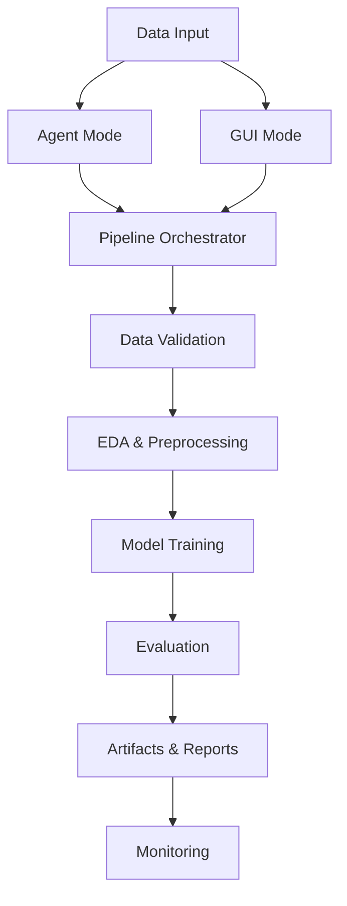

# Machine Learning Model Framework

An intelligent ML workflow framework featuring both **Agent Mode** for autonomous workflows and a **Traditional GUI** for interactive development.

## 🚀 Quick Start

=== "Agent Mode"

    ```bash
    # Launch intelligent agent
    ./run_agent.sh
    
    # Or use Docker
    make agent
    ```

=== "GUI Mode"

    ```bash
    # Launch traditional GUI
    python run_gui.py
    
    # Or use Docker
    make gui
    ```

=== "Docker Setup"

    ```bash
    # GUI with X11 forwarding
    chmod +x scripts/run_gui_docker.sh
    ./scripts/run_gui_docker.sh
    
    # Agent Mode
    docker compose up --build ml-agent
    ```

## ✨ Features

- **🤖 Agent Mode**: Autonomous ML workflows with state persistence
- **🖥️ Traditional GUI**: Interactive PyQt6 interface 
- **🔄 Full Pipeline**: Data validation → EDA → Training → Evaluation
- **📊 Monitoring**: Data drift detection with Evidently
- **🐳 Containerized**: One-command Docker setup
- **🧪 Tested**: Comprehensive test suite with GUI and E2E tests
- **📚 Documented**: Full documentation with MkDocs

## 🏗️ Architecture



## 📦 Installation

### Development Setup

```bash
# Clone repository
git clone https://github.com/hkevin01/Machine-Learning-Model.git
cd Machine-Learning-Model

# Setup environment
make setup
source venv/bin/activate  # Linux/Mac

# Install dependencies
make install-dev

# Compile pinned requirements
make compile-deps
```

### Production

```bash
pip install machine-learning-model
```

## 🧪 Testing

```bash
# All tests
make test

# GUI tests (requires X11)
make test-gui

# Agent Mode E2E tests
make test-agent

# With coverage
pytest --cov=src --cov-report=html
```

## 📊 Monitoring

```bash
# Generate drift reports
make monitor

# Custom datasets
python scripts/monitoring/generate_reports.py \
  --reference-data reference.csv \
  --current-data current.csv
```

## 🚀 CI/CD

- **Matrix Testing**: Python 3.8-3.12 on Linux
- **Security**: CodeQL + Bandit + Safety + Trivy
- **Quality Gates**: 80% coverage, mypy strict, format checks
- **Docker**: Automated GHCR publishing with SBOM
- **Documentation**: Auto-deploy to GitHub Pages

## 📖 Documentation

Visit [https://hkevin01.github.io/Machine-Learning-Model](https://hkevin01.github.io/Machine-Learning-Model) for full documentation.

## 🤝 Contributing

See [CONTRIBUTING.md](CONTRIBUTING.md) for development guidelines.

## 📄 License

This project is licensed under the MIT License - see the [LICENSE](LICENSE) file for details.
