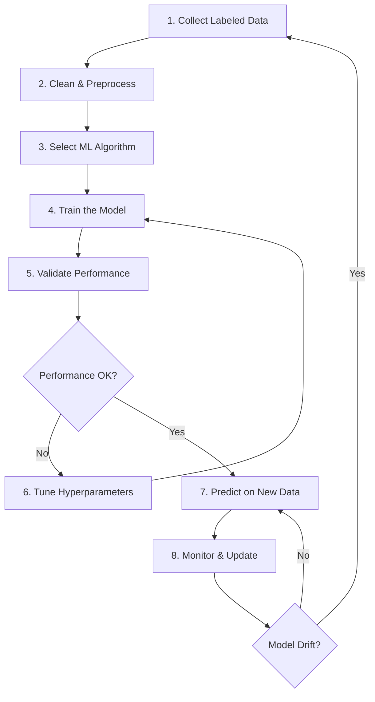

# Machine Learning Workflow Guide

This document outlines the complete machine learning workflow for the Machine Learning Model project, from data collection to model monitoring and updates.

## Workflow Overview



## Detailed Workflow Steps

### 1. Collect Labeled Data 📊

**Objective**: Gather high-quality, representative labeled dataset

**Tasks**:
- Define data requirements and target variables
- Collect data from various sources (APIs, databases, files)
- Ensure data quality and representativeness
- Document data sources and collection methods

**Location**: `/data/raw/`

**Scripts**:
- `scripts/collect_data.py`
- `scripts/data_validation.py`

**Notebooks**: `01_data_collection.ipynb`

**Deliverables**:
- Raw dataset files
- Data collection documentation
- Data quality report

**Quality Checks**:
- [ ] Sufficient sample size
- [ ] Balanced class distribution (for classification)
- [ ] Representative of target population
- [ ] Properly labeled/annotated
- [ ] Data lineage documented

---

### 2. Clean & Preprocess 🧹

**Objective**: Transform raw data into analysis-ready format

**Tasks**:
- Handle missing values
- Remove duplicates and outliers
- Fix data type inconsistencies
- Standardize formats and encodings
- Create data dictionaries

**Location**: `/data/processed/`

**Scripts**:
- `scripts/preprocess_data.py`
- `scripts/data_cleaning.py`

**Notebooks**: `02_data_preprocessing.ipynb`

**Processing Steps**:
1. **Data Exploration**
   - Statistical summaries
   - Missing value analysis
   - Distribution visualization
   - Correlation analysis

2. **Data Cleaning**
   - Handle missing values (imputation, removal)
   - Remove duplicates
   - Outlier detection and treatment
   - Data type corrections

3. **Data Transformation**
   - Normalization/standardization
   - Encoding categorical variables
   - Feature scaling
   - Date/time processing

**Deliverables**:
- Cleaned dataset
- Preprocessing pipeline
- Data cleaning report
- Feature documentation

**Quality Checks**:
- [ ] No missing values (or handled appropriately)
- [ ] Consistent data types
- [ ] Outliers identified and addressed
- [ ] Reproducible preprocessing pipeline

---

### 3. Select ML Algorithm 🎯

**Objective**: Choose appropriate algorithm based on problem type and data characteristics

**Tasks**:
- Define problem type (classification, regression, clustering)
- Analyze data characteristics (size, dimensionality, linearity)
- Research suitable algorithms
- Consider computational constraints
- Create algorithm comparison framework

**Location**: `/notebooks/03_algorithm_selection.ipynb`

**Algorithm Categories**:

**Classification**:
- Logistic Regression (linear, interpretable)
- Random Forest (non-linear, robust)
- SVM (high-dimensional data)
- Neural Networks (complex patterns)
- XGBoost (structured data)

**Regression**:
- Linear Regression (simple, interpretable)
- Random Forest Regressor (non-linear)
- SVR (non-linear relationships)
- Neural Networks (complex patterns)
- XGBoost (gradient boosting)

**Selection Criteria**:
- Data size and complexity
- Interpretability requirements
- Performance requirements
- Training time constraints
- Production deployment needs

**Deliverables**:
- Algorithm selection rationale
- Baseline model comparisons
- Algorithm recommendation

---

### 4. Train the Model 🏋️

**Objective**: Build and train the selected machine learning model

**Tasks**:
- Split data (train/validation/test)
- Set up training pipeline
- Configure initial hyperparameters
- Train the model
- Save model artifacts

**Location**: `/models/trained/`

**Scripts**:
- `scripts/train_model.py`
- `scripts/model_pipeline.py`

**Notebooks**: `04_model_training.ipynb`

**Training Process**:
1. **Data Splitting**
   ```
   Training Set (70%)   → Model training
   Validation Set (15%) → Hyperparameter tuning
   Test Set (15%)       → Final evaluation
   ```

2. **Model Training**
   - Initialize model with default parameters
   - Fit model on training data
   - Track training metrics
   - Save model checkpoints

3. **Training Monitoring**
   - Loss/accuracy curves
   - Learning rate schedules
   - Early stopping criteria
   - Resource utilization

**Deliverables**:
- Trained model files
- Training logs and metrics
- Model configuration
- Training pipeline code

**Quality Checks**:
- [ ] Model converges properly
- [ ] No overfitting signs
- [ ] Training metrics logged
- [ ] Reproducible training process

---

### 5. Validate Performance 📈

**Objective**: Evaluate model performance using appropriate metrics

**Tasks**:
- Define evaluation metrics
- Evaluate on validation set
- Compare against baselines
- Analyze model behavior
- Document performance results

**Location**: `/models/metadata/`

**Scripts**:
- `scripts/evaluate_model.py`
- `scripts/performance_analysis.py`

**Notebooks**: `05_model_evaluation.ipynb`

**Evaluation Metrics**:

**Classification**:
- Accuracy, Precision, Recall, F1-score
- ROC-AUC, PR-AUC
- Confusion Matrix
- Class-wise performance

**Regression**:
- MAE, MSE, RMSE
- R-squared, Adjusted R-squared
- Residual analysis
- Feature importance

**Model Analysis**:
- Feature importance/coefficients
- Prediction confidence intervals
- Error analysis by subgroups
- Model interpretability (SHAP, LIME)

**Deliverables**:
- Performance metrics report
- Model evaluation plots
- Error analysis document
- Model interpretation results

**Performance Thresholds**:
- [ ] Beats baseline model
- [ ] Meets business requirements
- [ ] Generalizes well (low variance)
- [ ] Acceptable bias-variance tradeoff

---

### 6. Tune Hyperparameters ⚙️

**Objective**: Optimize model performance through hyperparameter tuning

**Tasks**:
- Define hyperparameter search space
- Choose tuning strategy
- Execute hyperparameter search
- Validate best parameters
- Update model configuration

**Location**: `/models/experiments/`

**Scripts**:
- `scripts/hyperparameter_tuning.py`
- `scripts/grid_search.py`

**Notebooks**: `06_hyperparameter_tuning.ipynb`

**Tuning Strategies**:
1. **Grid Search**: Exhaustive search over parameter grid
2. **Random Search**: Random sampling from parameter space
3. **Bayesian Optimization**: Smart parameter exploration
4. **Hyperband**: Multi-fidelity optimization

**Common Hyperparameters**:
- **Random Forest**: n_estimators, max_depth, min_samples_split
- **SVM**: C, gamma, kernel
- **Neural Networks**: learning_rate, batch_size, hidden_layers
- **XGBoost**: learning_rate, max_depth, n_estimators

**Tuning Process**:
1. Define parameter ranges
2. Set up cross-validation
3. Execute search strategy
4. Analyze results
5. Select best parameters
6. Retrain final model

**Deliverables**:
- Hyperparameter search results
- Best parameter configuration
- Performance improvement analysis
- Tuned model artifacts

**Quality Checks**:
- [ ] Systematic parameter exploration
- [ ] Cross-validation used
- [ ] Performance improvement documented
- [ ] No overfitting to validation set

---

### 7. Predict on New Data 🔮

**Objective**: Deploy model for making predictions on new, unseen data

**Tasks**:
- Prepare prediction pipeline
- Load trained model
- Preprocess new data
- Generate predictions
- Format and return results

**Location**: `/src/machine_learning_model/`

**Scripts**:
- `scripts/predict.py`
- `scripts/batch_prediction.py`

**Implementation**: `src/machine_learning_model/predict.py`

**Prediction Pipeline**:
1. **Data Input**
   - API endpoints
   - Batch files
   - Real-time streams

2. **Preprocessing**
   - Apply same transformations as training
   - Handle missing values
   - Feature engineering

3. **Model Inference**
   - Load model artifacts
   - Generate predictions
   - Calculate confidence scores

4. **Output Formatting**
   - Structured predictions
   - Confidence intervals
   - Feature explanations

**Deployment Options**:
- **Batch Processing**: Scheduled predictions on large datasets
- **Real-time API**: Individual predictions via REST API
- **Streaming**: Continuous predictions on data streams

**Deliverables**:
- Prediction pipeline code
- API endpoints (if applicable)
- Batch processing scripts
- Prediction documentation

**Quality Checks**:
- [ ] Consistent preprocessing
- [ ] Error handling implemented
- [ ] Performance monitoring
- [ ] Scalable architecture

---

### 8. Monitor & Update 📊

**Objective**: Continuously monitor model performance and update when necessary

**Tasks**:
- Set up monitoring dashboards
- Track prediction accuracy
- Detect data/concept drift
- Schedule model retraining
- Version control models

**Location**: `/scripts/monitoring/`

**Scripts**:
- `scripts/monitor_model.py`
- `scripts/drift_detection.py`
- `scripts/model_update.py`

**Monitoring Components**:

**Performance Monitoring**:
- Prediction accuracy over time
- Response time and throughput
- Error rates and exceptions
- Resource utilization

**Data Drift Detection**:
- Feature distribution changes
- Data quality degradation
- New categorical values
- Statistical tests (KS test, chi-square)

**Concept Drift Detection**:
- Model performance degradation
- Changing relationships
- Seasonal effects
- Business metric changes

**Update Triggers**:
- Performance below threshold
- Significant data drift
- New data availability
- Business requirement changes

**Automated Updates**:
1. **Trigger Detection**
   - Performance monitoring alerts
   - Scheduled retraining
   - Manual triggers

2. **Data Preparation**
   - Collect new labeled data
   - Merge with existing data
   - Quality validation

3. **Model Retraining**
   - Retrain with updated data
   - Hyperparameter optimization
   - Performance validation

4. **Deployment**
   - A/B testing new model
   - Gradual rollout
   - Rollback capabilities

**Deliverables**:
- Monitoring dashboards
- Drift detection alerts
- Automated retraining pipeline
- Model versioning system

**Quality Checks**:
- [ ] Real-time monitoring
- [ ] Automated alerting
- [ ] Version control
- [ ] Rollback capabilities

## Workflow Best Practices

### 1. Documentation
- Document every step and decision
- Maintain data lineage
- Version control all code and configs
- Keep experiment logs

### 2. Reproducibility
- Use fixed random seeds
- Pin dependency versions
- Containerize environments
- Save all configurations

### 3. Validation
- Use proper cross-validation
- Hold out test sets
- Validate on production-like data
- Monitor for overfitting

### 4. Automation
- Automate repetitive tasks
- Use CI/CD for model deployment
- Implement monitoring alerts
- Schedule regular retraining

### 5. Collaboration
- Use consistent file organization
- Implement code reviews
- Share notebooks and findings
- Maintain team communication

## Tools and Technologies

**Data Processing**:
- pandas, numpy (data manipulation)
- scikit-learn (preprocessing)
- matplotlib, seaborn (visualization)

**Machine Learning**:
- scikit-learn (classical ML)
- xgboost, lightgbm (gradient boosting)
- tensorflow, pytorch (deep learning)

**Experimentation**:
- mlflow (experiment tracking)
- wandb (experiment management)
- optuna (hyperparameter optimization)

**Deployment**:
- docker (containerization)
- fastapi (API development)
- kubernetes (orchestration)

**Monitoring**:
- grafana (dashboards)
- prometheus (metrics)
- evidently (drift detection)

This workflow ensures systematic, reproducible, and maintainable machine learning development from research to production.
